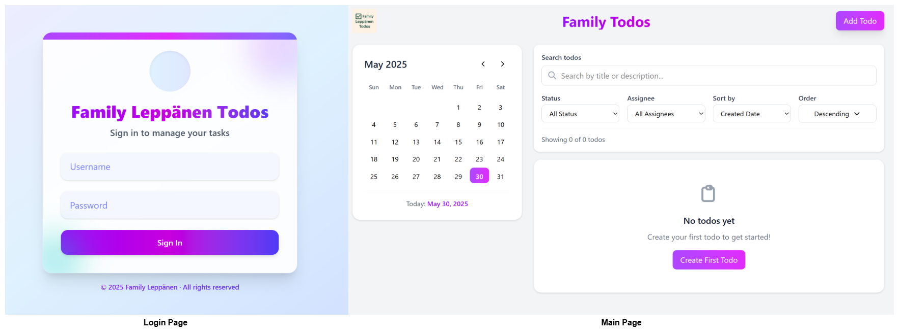
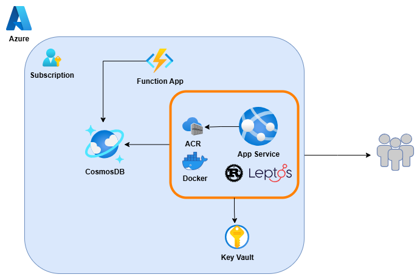

# <p align="center"> 🌌 Cosmic Todos </p>

<div align="center">


## A modern, beautiful family task management application built with Rust, Leptos and Azure Cosmos DB*


</div>

---

## 📖 About

Cosmic Todos is a sleek, modern web application designed for family task management. Built with cutting-edge Rust web technologies, it combines the performance of WebAssembly with the elegance of reactive UI components to create a delightful user experience.

### 🎯 Why Cosmic Todos?

- **Family-First Design**: Built specifically for family collaboration with multi-user support
- **Modern Architecture**: Leverages Rust's type safety and performance in the browser
- **Beautiful Interface**: Stunning gradient designs and smooth animations
- **Developer Experience**: Type-safe development with excellent tooling

## ✨ Features

### 🎨 **Beautiful User Interface**

- Modern gradient-based design system
- Responsive layout that works on all devices
- Smooth animations and micro-interactions
- Dark mode support (coming soon)

### 📋 **Comprehensive Task Management**

- Create, edit, and delete tasks with rich metadata
- Set due dates and times with timezone awareness
- Track task status (Not Started, In Progress, Completed, Blocked)
- Visual indicators for overdue tasks

### 👥 **Family-Focused**

- Multi-user support for family members
- Assign tasks to specific family members
- Filter tasks by assignee
- Shared family dashboard

### 🔐 **Secure Authentication**

- Environment-based configuration
- Session management
- Secure login flow

### 📱 **Responsive & Accessible**

- Mobile-first responsive design
- Keyboard navigation support
- Screen reader friendly
- Touch-friendly interface


## 📸 Screenshots

<div align="center">



*Cosmic Todos in action*

</div>


## 🏗️ Architecture

Cosmic Todos follows a modern full-stack architecture leveraging Rust's ecosystem for both frontend and backend components, with Azure cloud services providing scalable infrastructure.



### Architecture Overview

The application is built on a **three-tier architecture** with clear separation of concerns:

- **Frontend Layer**: Leptos-based reactive UI compiled to WebAssembly, providing type-safe client-side interactions with excellent performance
- **API Layer**: Rust-based serverless functions hosted on Azure Functions, handling business logic and data validation
- **Data Layer**: Azure Cosmos DB providing globally distributed, multi-model database capabilities with automatic scaling

**Key Architectural Benefits:**
- **Type Safety**: End-to-end Rust ensures compile-time error detection and prevents runtime errors
- **Performance**: WebAssembly frontend delivers near-native performance in the browser
- **Scalability**: Serverless architecture automatically scales based on demand
- **Global Distribution**: Azure Cosmos DB enables low-latency access worldwide
- **Developer Experience**: Shared types and models between frontend and backend reduce duplication and increase maintainability

The architecture supports modern development practices including continuous deployment, containerization, and cloud-native patterns while maintaining the performance and safety guarantees that Rust provides.

### Cosmos DB
Cosmic Todos uses **Azure Cosmos DB** as its primary data store, providing a globally distributed, multi-model database service with the following features:
- **Multi-Model Support**: Supports document, key-value, graph, and column-family data models
- **Global Distribution**: Data is replicated across multiple Azure regions for low-latency access
- **Automatic Indexing**: All data is automatically indexed without requiring schema definitions
- **Rich Query Capabilities**: Supports SQL-like queries, stored procedures, and change feed processing
- **High Availability**: Offers 99.999% availability SLA with multi-region writes
- **Security**: Built-in encryption at rest and in transit, with fine-grained access control
- **Serverless Options**: Pay-per-request pricing model for cost efficiency
- **Change Feed**: Real-time data synchronization capabilities for reactive applications

Data is stored in a JSON-like format, allowing for flexible schema design and easy integration with the Rust application. The Cosmos DB SDK for Rust provides seamless interaction with the database, enabling efficient data retrieval and manipulation.

Example Cosmos DB Document Structure:

```json
{
  "id": "task123",
  "title": "Grocery Shopping",
  "description": "Buy groceries for the week",
  "status": "Not Started",
  "dueDate": "2023-10-15T12:00:00Z",
  "assignee": "family_member_id",
  "createdAt": "2023-10-01T10:00:00Z",
  "updatedAt": "2023-10-01T10:00:00Z"
}
```

### Azure Functions
Cosmic Todos uses **Azure Functions** to implement serverless APIs that handle business logic and data operations. This allows for a scalable, event-driven architecture that can respond to HTTP requests, database changes, and other triggers without managing server infrastructure. 

## 🛠️ Technology Stack

| Category | Technology |
|----------|------------|
| **Frontend** | [Leptos](https://leptos.dev/) - Reactive Rust web framework |
| **Language** | [Rust](https://www.rust-lang.org/) with WebAssembly |
| **Styling** | [Tailwind CSS](https://tailwindcss.com/) |
| **Database** | [Azure Cosmos DB](https://azure.microsoft.com/en-us/services/cosmos-db/) |
| **Hosting** | [Azure Static Web Apps](https://azure.microsoft.com/en-us/services/app-service/static/) |
| **Build Tool** | [Cargo Leptos](https://github.com/leptos-rs/cargo-leptos) |
| **Date/Time** | [Chrono](https://docs.rs/chrono/) |
| **Routing** | [Leptos Router](https://docs.rs/leptos_router/) |
| **Task Runner** | [Just](https://github.com/casey/just) |
| **Container** | [Docker](https://www.docker.com/) |
| **CI/CD** | [GitHub Actions]() - For automated builds and deployments |
| **Testing** | [Playwright]() - End-to-end testing framework for web applications |
| **Cloud** | [Azure](https://azure.microsoft.com/)|

## 🚀 Getting Started

### Prerequisites

- [Rust](https://rustup.rs/) (latest stable)
- [Node.js](https://nodejs.org/) (for Tailwind CSS)
- [Just](https://github.com/casey/just) (optional, for task automation)
- [Azure CLI](https://docs.microsoft.com/en-us/cli/azure/) (for Azure deployment)

### 🔧 Installation

1. **Clone the repository**

   ```bash
   git clone https://github.com/yourusername/cosmic-todos.git
   cd cosmic-todos
    ```

2. **Install Rust dependencies**

  ```bash
  cargo install cargo-leptos
  rustup target add wasm32-unknown-unknown
  ```

3. **Set up your environment variables**

  ```bash
  cp .env.example .env
  # Edit .env with your credentials
  export COSMIC_USERNAME=your_username
  export COSMIC_PASSWORD=your_password
  export AZURE_COSMOS_CONNECTION_STRING=your_cosmos_connection_string
  ```

4. **Run the development server**

```bash
just run
# or 
cargo leptos watch
```

5. **Open your browser and navigate to `http://localhost:3000`**

☁️ Azure Deployment
Deploy to Azure Static Web Apps:

```bash
just deploy
# or
# Login to Azure
az login

# Create resource group
az group create --name cosmic-todos-rg --location eastus

# Deploy using Azure CLI
az staticwebapp create \
  --name cosmic-todos \
  --resource-group cosmic-todos-rg \
  --source https://github.com/yourusername/cosmic-todos \
  --location eastus \
  --branch main \
  --app-location "/" \
  --api-location "api" \
  --output-location "dist"
```

🐳 Docker Setup

```bash
# Build the image
docker build -t cosmic-todos .

# Run the container
docker run -p 3000:80 \
  -e COSMIC_USERNAME=admin \
  -e COSMIC_PASSWORD=password \
  -e AZURE_COSMOS_CONNECTION_STRING=your_connection_string \
  cosmic-todos
```

📋 Development
Available Commands
This project uses Just for task automation:

```bash
just --list                 # Show all available commands
just format                 # Format code with rustfmt
just lint                   # Lint code with clippy
just check                  # Run format and lint checks
just run                    # Start development server
just build                  # Build in debug mode
just build-release          # Build in release mode
just test                   # Run tests
just clean                  # Clean build artifacts
just setup                  # Set up development environment
just production             # Full production build
just deploy                 # Deploy to Azure
just docker-build           # Build Docker image
```

If you don't have Just installed, check the [Just manual](https://just.systems/man/en/introduction.html)

🎨 Styling
The project uses Tailwind CSS with custom configurations:

Color Palette: Purple, fuchsia, and indigo gradients
Components: Reusable UI components with consistent styling
Responsive: Mobile-first approach with breakpoint utilities

🧪 Testing

```bash
# Run all tests
just test

# Run specific test
cargo test test_name

# Run with coverage
cargo tarpaulin --out html
```

📁 Project Structure

```bash
cosmic-todos/
├── src/
│   ├── app.rs              # Main application component
│   ├── components/         # Reusable UI components
│   ├── pages/             # Page components
│   └── lib.rs             # Library root
├── style/                 # Tailwind CSS styles
├── public/                # Static assets
├── api/                   # Azure Functions API
├── Cargo.toml             # Rust dependencies
├── Dockerfile             # Container configuration
├── justfile               # Task automation
├── staticwebapp.config.json # Azure SWA configuration
└── README.md              # This file
```

🔧 Configuration
Environment Variables

| Variable | Description | Required |
|----------|-------------|----------|
| COSMIC_USERNAME    | Application username | Yes      |
| COSMIC_PASSWORD    | Application password | Yes      |
| AZURE_COSMOS_CONNECTION_STRING | Cosmos DB connection string | Yes      |
| RUST_LOG | Log level (info, debug, warn, error) | No       |  


🙏 Acknowledgments

- Leptos - For the amazing Rust web framework  
- Tailwind CSS - For the utility-first CSS framework
- Azure - For reliable cloud infrastructure
- Rust Community - For the incredible ecosystem
